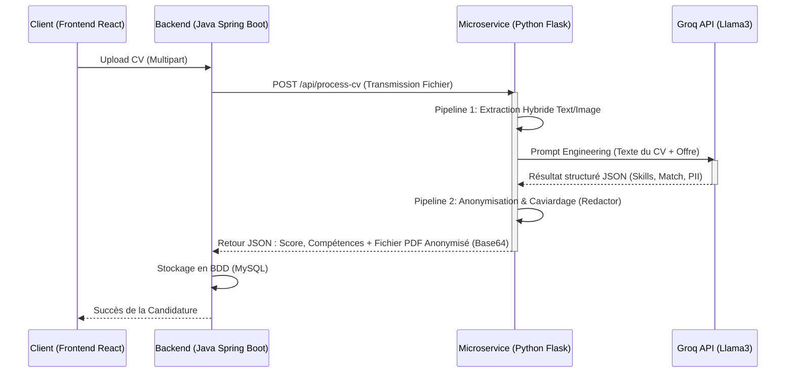

# 🧠 Documentation Détaillée du Module IA (SmartRecruit)

Ce document approfondit l'architecture, les outils et les **pipelines métiers** du microservice d'Intelligence Artificielle (Python/Flask) au sein de la plateforme **SmartRecruit**.

Le rôle de ce module est d'agir comme le cerveau cognitif de l'application : il lit les CVs (même scannés), les comprend, extrait les compétences, calcule le matching avec les offres, et **anonymise** les données personnelles pour garantir un traitement équitable et sans biais.

---

## 🏗️ 1. Pipeline Architectural Inter-Services

Toute la partie IA est construite comme un microservice **Stateless** (sans base de données). L'application principale Java (Spring Boot) délègue les tâches lourdes de traitement de texte et vision par ordinateur à ce service Python.



### Outils de la Stack IA :
*   **🐍 Python & Flask** : Framework web léger pour exposer les API (`app1.py`).
*   **📄 PyMuPDF (`fitz`)** : Moteur PDF ultra-rapide pour la lecture des blocs textuels et l'édition géométrique du fichier.
*   **👁️ Tesseract OCR (`pytesseract`)** : Reconnaissance Optique de Caractères de Google, utilisé comme fallback pour les images.
*   **⚡ Groq API** : Moteur d'inférence LLM (Large Language Model) choisi pour sa vitesse fulgurante dans le traitement du NLP (Natural Language Processing).

---

## 🔍 2. Pipeline d'Extraction Hybride (Le Lecteur)

Avant qu'une IA ne puisse analyser un CV, il faut transformer un fichier physique (PDF) en suite logique de caractères. Le défi est de gérer deux cas : les PDF générés informatiquement (par Word/Canva) et les PDF images (cv imprimés puis scannés).

```mermaid
flowchart TD
    Start([Fichier PDF entrant]) --> Loop[Boucle sur chaque page]
    Loop --> Check{Longueur du texte\n(PyMuPDF) > 50 chars?}
    
    Check -- "Oui (PDF Natif)" --> Natif[Extraction par blocs\n(Tri mathématique selon colonnes)]
    Check -- "Non (Image / Scanné)" --> Convert[Conversion de la page en Image\navec Zoom x3 (Augmentation des DPI)]
    
    Convert --> OCR[Tesseract OCR\nExtraction des mots & coordonnées]
    
    Natif --> Merge((Concaténation\ndu texte))
    OCR --> Merge
    
    Merge --> End([Texte Brut Final])
```

> [!NOTE]
> **Pourquoi une lecture par "blocs mathématiques" ?** 
> Si un CV a deux colonnes (à gauche l'expérience, à droite les compétences), une lecture PDF standard lira les deux lignes en croisé, mélangeant les phrases. PyMuPDF trie spatialement les blocs pour garder la cohérence du texte.

---

## 🧠 3. Pipeline d'Analyse Cognitive (Le Cerveau LLM)

Une fois le texte extrait, il est envoyé au modèle de langage via l'API Groq (fichier `llm/groq_service.py`). 

L'ingénierie des Prompts (Prompt Engineering) force l'IA à :
1. **Profiler le candidat** : Extraire une liste claire de `competences` et de `diplomes`.
2. **Evaluer le Match** : Calculer un taux de compatibilité (0-100%) entre le CV et l'Offre, avec justification explicative.
3. **La Chasse aux PII (Personal Identifiable Information)** : L'IA dresse une liste stricte contenant **exactement** la manière dont les informations personnelles (Noms, Emails, Adresses, Numéros) sont écrites dans le texte, pour les passer au "Caviardeur".

---

## 🛡️ 4. Pipeline d'Anonymisation ou "Caviardage" (Le Chirurgien)

Le fichier `extraction/redactor.py` prend la liste des mots sensibles identifiés par le LLM et va nettoyer le PDF.

```mermaid
flowchart TD
    Start([PDF Original + Liste Mots Sensibles]) --> Doc[fitz.open(PDF)]
    
    Doc --> PageLoop[Parcours de la page]
    PageLoop --> CheckType{Est-ce une Image?}
    
    CheckType -- "Oui" --> OCRMap[Re-lancer Tesseract\nMapper les mots OCR\navec les Pixels (X, Y)]
    CheckType -- "Non" --> VectorMap[Chercher le mot\ndans les vecteurs natifs\nRécupérer la Bounding Box (X, Y)]
    
    OCRMap --> Combine(Liste des Zones Sensibles = Rectangles)
    VectorMap --> Combine
    
    Combine --> Redact[add_redact_annot()\nCréation de zones de suppression]
    Redact --> Apply[apply_redactions()\nDestruction PHYSIQUE du texte binaire]
    
    Apply --> Paint[Dessiner un rectangle de censure stylisé\n(Couleur: Navy Blue, Radius: 0.35)]
    
    Paint --> End([Fichier PDF CV_Anonymisé])
```

> [!CAUTION] Sécurité et Fuites de Données
> L'utilisation de `apply_redactions()` est cruciale. L'outil ne se contente pas de dessiner une boîte noire sur le texte (dont un pirate informatique pourrait facilement copier le texte en dessous). Il supprime la chaîne de caractères correspondante du flux binaire du PDF. Le candidat est ainsi protégé à 100%.

---

## 🚀 5. Performance et Scalabilité

- L'utilisation de **Groq API** permet un traitement presque instantané de l'inférence. Llama3 retourne une analyse JSON de 500 mots en moins d'une seconde.
- Le goulot d'étranglement potentiel reste l'OCR de **Tesseract**. Pour pallier cela, l'OCR ne se déclenche dynamiquement _que si la page est identifiée comme illisible_.
- Étant 100% **Stateless**, ce module Flask Python ne garde aucun fichier en cache. Il peut être déployé sur des conteneurs via **Kubernetes** ou **Docker** avec un auto-scaling configuré pour absorber un pic massif de candidatures en parallèle.
